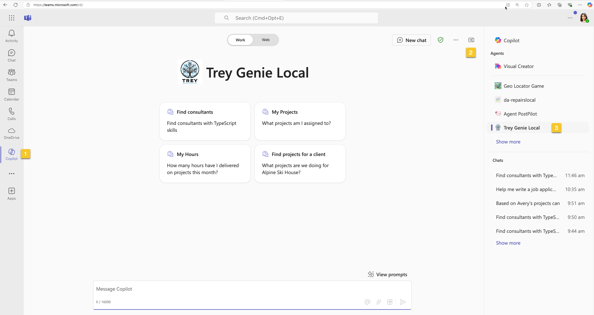
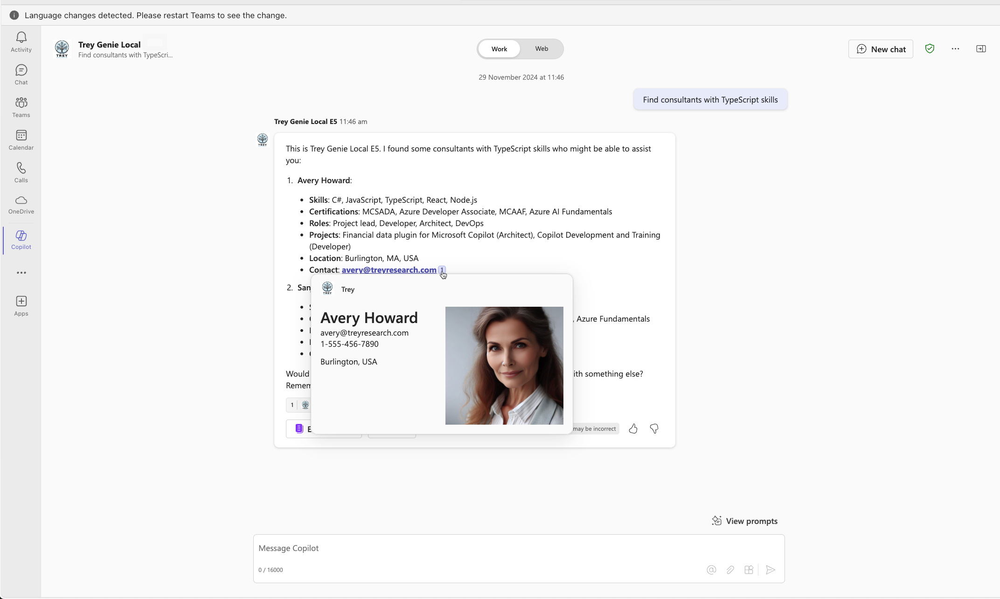

# Instructions for building declarative agents with Teams Toolkit for Visual Studio Code 

This document showcases how to run the declarative agent, Trey Genie which demonstrates an agent which is grounded in the API plugin as well as in specific SharePoint files.

The declarative agent contains instructions, a plugin (skills) to call real time API and uses knowledge from documents stored in SharePoint Online as grounding data.

## Prerequisites

- [Node.js 18](https://nodejs.org/)
- [Teams Toolkit Visual Studio Code Extension](https://aka.ms/teams-toolkit), v5.10.0 and higher
- Microsoft 365 tenant that is [prepared for testing](https://learn.microsoft.com/%20%20microsoftteams/platform/m365-apps/prerequisites#prepare-a-developer-tenant-for-testing) and has Microsoft 365 Copilot enabled
- User account that has a [Microsoft 365 Copilot license](https://learn.microsoft.com/microsoft-365-copilot/extensibility/prerequisites#prerequisites)

## Set up SharePoint Site 

-  Create SharePoint Online site Teams Site with the name `Trey Research legal` 
- In it's `Documents` folder upload all the files from [sampleDocs](../../src/declarative-agent/sampleDocs/) folder in this repo. 

## Set up Trey Genie locally 
- Clone this github repo, navigate to folder **src/declarative-agent/**  and open it in Visual Studio Code.
- In the folder, select **env** folder and rename:
**.env.local.sample** file to **.env.local**
**.env.local.user.sample** file to **env.local.user**
- Open **env.local** file and update the value of `SHAREPOINT_DOCS_URL` with you SharePoint Online site's absolute URL, where you uploaded the sample documents in the previous step

## Run Trey Genie locally in Teams

Select Teams Toolkit on Visual Studio Code navigation bar, login with Microsoft 365 Account.

>Make sure that sideloading is enabled for your account. If Sideloading is not enabled yet:
>
>1️⃣ Navigate to https://admin.microsoft.com/, which is the Microsoft 365 Admin Center.
>
>2️⃣ In the left panel of the admin center, select Show all to open up the entire navigation. When the panel opens, select Teams to >open the Microsoft Teams admin center.
>
>3️⃣ In the left of the Microsoft Teams admin center, open the Teams apps accordion. Select Setup Policies, you will see a list of >App setup policies. Then, select the Global (Org-wide default) policy.
>
>4️⃣ Ensure the first switch, Upload custom apps is turned On.

Start debugging your app by selecting **Run and Debug** tab on Visual Studio Code and Debug in Teams (Edge) or Debug in Teams (Chrome).  Or select F5.

Microsoft Teams will pop up on your browser. 
Open the Copilot chat 1️⃣  and the right flyout 2️⃣ to show your previous chats and declarative agents and select the Trey Genie Local copilot 3️⃣ .

Try one of the conversation starters like `Find consultants with TypeScript skills`.

### Prompts that work in the completed solution

  * what trey projects am i assigned to?
    (NOTE: The logged in user is assumed to be consultant "Avery Howard". As this sample does not have Auth)
  * what trey projects is domi working on?
  * do we have any trey consultants with azure certifications?
  * what trey projects are we doing for relecloud?
  * which trey consultants are working with woodgrove bank?
  * in trey research, how many hours has avery delivered this month?
  * please find a trey consultant with python skills who is available immediately
  * are any trey research consultants available who are AWS certified? (multi-parameter!)
  * does trey research have any architects with javascript skills? (multi-parameter!)
  * what trey research designers are working at woodgrove bank? (multi-parameter!)
   * please charge 10 hours to woodgrove bank in trey research (POST request)
   * please add sanjay to the contoso project for trey research (POST request with easy to forget entities, hoping to prompt the user; for now they are defaulted)

